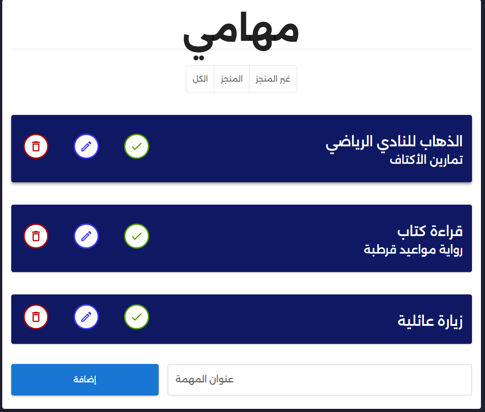

# ✅ React Todo List

A modern **React.js** to-do list app built with **Material UI (MUI)** and Arabic interface support (RTL).  
The app allows you to manage your daily tasks — add, edit, delete, and mark them as completed — all with a clean and elegant design.

---

## 🖼️ UI Preview



---

## 🚀 Overview

This app provides a simple yet powerful way to organize your tasks:

- Add new tasks easily
- Edit existing tasks
- Delete tasks with confirmation dialog
- Mark tasks as completed or pending
- Filter tasks by status (All / Completed / Not Completed)
- Data is stored locally using **localStorage**, so tasks stay saved even after page reloads

---

## ⚙️ Technologies Used

- **React.js** – For building the UI
- **Material UI (MUI)** – For cards, buttons, dialogs, icons, and grid layout
- **React Context API** – For managing global state
- **UUID** – To generate unique IDs for tasks
- **localStorage** – For saving tasks locally in the browser

---

## 🧩 Components

- **App.js** → Wraps the app in a ThemeProvider and TodosContext
- **ToDoList.js** → Displays all tasks, filters, and the add-task input
- **ToDo.js** → Handles each task’s display, editing, deleting, and completion
- **TodosContext.js** → Provides shared task state across components

---

## 🎨 Features & Design

- Fully **Right-to-Left (RTL)** layout for Arabic users
- Elegant **Material Design** cards with shadows and rounded corners
- Color-coded action buttons (🟢 complete, 🔵 edit, 🔴 delete)
- Responsive layout that works on all screen sizes

---

## 💻 Run Locally

```bash
git clone https://github.com/sahiralzakaria/React-Todo-List.git
cd React-Todo-List
npm install
npm start
```

Then open [http://localhost:3000](http://localhost:3000) in your browser.

---

## 🧠 Future Improvements

- Add due dates for tasks
- Support task categories and priorities
- Implement search functionality
- Add light/dark theme toggle

---

## 👨‍💻 Author

- [](https://github.com/sahiralzakaria) **GitHub:** [sahiralzakaria](https://github.com/sahiralzakaria)
- [](https://www.linkedin.com/in/sahir-zakaria-39873531b) **LinkedIn:** [sahir-zakaria](https://www.linkedin.com/in/sahir-zakaria-39873531b)
- [](mailto:sahir.alzakaria@gmail.com) **Email:** sahir.alzakaria@gmail.com

---

<div align="center">
  <p>Made with ❤️ by <strong>Sahir Zakaria</strong></p>
  <p><em>Stay productive and organized! 🗓️</em></p>
</div>
